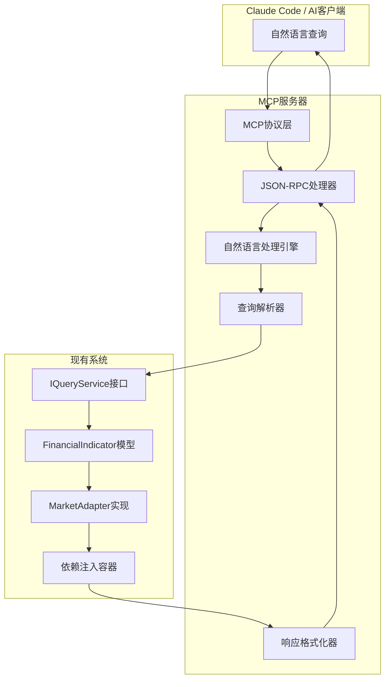

# MCP（Model Context Protocol）开发计划 - 自然语言财务指标查询系统

## 已明确的决策

- **现有架构复用**：基于akshare-value-investment项目的dependency-injector架构
- **Protocol接口设计**：遵循现有I前缀命名规范和接口设计原则
- **100%字段覆盖率**：保持现有151个财务指标字段的完整覆盖
- **跨市场支持**：延续A股、港股、美股三个市场支持
- **技术栈一致性**：Python 3.13+、akshare、dependency-injector

## 整体规划概述

### 项目目标

基于现有akshare-value-investment项目架构，开发MCP（Model Context Protocol）服务器，使Claude Code等AI工具能够通过自然语言查询财务指标数据，实现"用自然语言对财务指标进行查询"的用户需求。

### 技术栈

**核心技术栈**：
- Python 3.13+
- MCP SDK (mcp库)
- dependency-injector (现有)
- akshare >= 1.17.83 (现有)
- 现有Protocol接口架构

**新增技术组件**：
- 自然语言处理：spaCy/NLTK或大模型API
- JSON-RPC 2.0协议实现
- 查询解析引擎
- 响应格式化器

### 主要阶段

1. **阶段1：MCP基础架构设计** - 搭建MCP服务器框架和协议接口
2. **阶段2：自然语言处理引擎** - 实现NLP到结构化查询的转换
3. **阶段3：集成与优化** - 与现有系统集成，性能优化和测试完善

### 详细任务分解

#### 阶段1：MCP基础架构设计

- **任务1.1**：MCP服务器架构设计
  - 目标：设计符合MCP规范的服务器架构
  - 输入：MCP规范文档、现有项目架构分析
  - 输出：MCP架构设计文档、核心接口定义
  - 涉及文件：`src/akshare_value_investment/mcp/`
  - 预估工作量：2-3天

- **任务1.2**：JSON-RPC 2.0协议实现
  - 目标：实现标准的JSON-RPC通信协议
  - 输入：MCP协议规范、现有接口模型
  - 输出：JSON-RPC处理器、错误处理机制
  - 涉及文件：`src/akshare_value_investment/mcp/server.py`
  - 预估工作量：2天

- **任务1.3**：MCP资源定义
  - 目标：定义MCP资源模型（股票、指标等）
  - 输入：现有FinancialIndicator模型、MCP资源规范
  - 输出：MCP资源定义、URI模板
  - 涉及文件：`src/akshare_value_investment/mcp/resources.py`
  - 预估工作量：1-2天

- **任务1.4**：工具（Tools）定义
  - 目标：定义MCP工具接口（查询函数）
  - 输入：现有IQueryService接口、MCP工具规范
  - 输出：工具定义、参数规范
  - 涉及文件：`src/akshare_value_investment/mcp/tools.py`
  - 预估工作量：2天

#### 阶段2：自然语言处理引擎

- **任务2.1**：查询意图识别模块
  - 目标：识别用户查询意图（查询类型、指标、时间范围等）
  - 输入：自然语言查询样本、现有字段映射
  - 输出：意图识别器、实体提取器
  - 涉及文件：`src/akshare_value_investment/mcp/nlp/intent.py`
  - 预估工作量：3-4天

- **任务2.2**：语义解析引擎
  - 目标：将自然语言转换为结构化查询参数
  - 输入：识别出的意图和实体、现有查询接口
  - 输出：语义解析器、查询构建器
  - 涉及文件：`src/akshare_value_investment/mcp/nlp/parser.py`
  - 预估工作量：4-5天

- **任务2.3**：指标名称映射增强
  - 目标：建立自然语言描述到标准字段的映射
  - 输入：现有151个字段、常用财务术语
  - 输出：增强版字段映射器、同义词处理
  - 涉及文件：`src/akshare_value_investment/mcp/nlp/mapper.py`
  - 预估工作量：2-3天

- **任务2.4**：上下文管理模块
  - 目标：处理多轮对话和上下文保持
  - 输入：对话样本、上下文需求分析
  - 输出：上下文管理器、对话状态跟踪
  - 涉及文件：`src/akshare_value_investment/mcp/context.py`
  - 预估工作量：3天

#### 阶段3：集成与优化

- **任务3.1**：现有系统集成
  - 目标：将MCP层与现有IQueryService等接口集成
  - 输入：现有依赖注入容器、MCP服务接口
  - 输出：集成测试、适配器实现
  - 涉及文件：`src/akshare_value_investment/mcp/integration.py`
  - 预估工作量：2-3天

- **任务3.2**：响应格式优化
  - 目标：优化返回数据的可读性和有用性
  - 输入：用户反馈样本、MCP响应规范
  - 输出：响应格式化器、数据可视化准备
  - 涉及文件：`src/akshare_value_investment/mcp/formatter.py`
  - 预估工作量：2天

- **任务3.3**：性能优化
  - 目标：优化查询响应速度和资源使用
  - 输入：性能测试结果、瓶颈分析
  - 输出：缓存机制、并发处理优化
  - 涉及文件：`src/akshare_value_investment/mcp/cache.py`
  - 预估工作量：2-3天

- **任务3.4**：测试覆盖完善
  - 目标：建立完整的MCP功能测试体系
  - 输入：现有测试框架、MCP测试需求
  - 输出：MCP专用测试套件、集成测试
  - 涉及文件：`tests/mcp/`
  - 预估工作量：3天

## 需要进一步明确的问题

### 问题1：自然语言处理技术选型

**推荐方案**：

- **方案A：传统NLP库组合**
  - 技术栈：spaCy + NLTK + 自定义规则
  - 优点：完全本地化、无外部依赖、可控性强
  - 缺点：开发周期长、语义理解能力有限、需要大量规则维护

- **方案B：大模型API集成**
  - 技术栈：OpenAI GPT API / Claude API 或本地LLM
  - 优点：语义理解强、开发快速、适应性好
  - 缺点：外部依赖、网络延迟、API成本

- **方案C：混合方案**
  - 技术栈：基础规则处理 + 关键复杂查询使用LLM
  - 优点：平衡成本和效果、可控性与灵活性兼顾
  - 缺点：架构复杂度高、需要设计路由逻辑

**等待用户选择**：

```
请选择您偏好的方案，或提供其他建议：
[ ] 方案A：传统NLP库组合（推荐用于企业级部署）
[ ] 方案B：大模型API集成（推荐用于快速原型验证）
[ ] 方案C：混合方案（推荐用于生产环境平衡）
[ ] 其他方案：_____
```

### 问题2：MCP部署和运行方式

**推荐方案**：

- **方案A：独立服务器模式**
  - 部署方式：独立的MCP服务器进程
  - 优点：隔离性好、可独立扩展、维护简单
  - 缺点：需要额外的进程管理、资源占用较多

- **方案B：嵌入式模式**
  - 部署方式：作为现有Python库的扩展模块
  - 优点：资源占用少、集成度高、部署简单
  - 缺点：耦合度较高、扩展性有限

- **方案C：混合模式**
  - 部署方式：核心功能嵌入 + 高级功能独立服务
  - 优点：灵活性好、可根据需求选择部署方式
  - 缺点：架构复杂、需要设计好分层

**等待用户选择**：

```
请选择您偏好的部署方式：
[ ] 方案A：独立服务器模式
[ ] 方案B：嵌入式模式
[ ] 方案C：混合模式
[ ] 其他建议：_____
```

### 问题3：数据缓存和性能策略

**推荐方案**：

- **方案A：内存缓存**
  - 缓存方式：Python内存缓存（LRU Cache等）
  - 优点：实现简单、响应速度快、无外部依赖
  - 缺点：重启失效、内存占用、无法分布式

- **方案B：文件系统缓存**
  - 缓存方式：本地文件系统 + SQLite
  - 优点：持久化、结构化查询、重启保持
  - 缺点：I/O开销、文件管理复杂

- **方案C：Redis缓存**
  - 缓存方式：Redis分布式缓存
  - 优点：高性能、分布式、丰富数据结构
  - 缺点：额外部署依赖、运维复杂

**等待用户选择**：

```
请选择您的缓存策略偏好：
[ ] 方案A：内存缓存（轻量级方案）
[ ] 方案B：文件系统缓存（平衡方案）
[ ] 方案C：Redis缓存（高性能方案）
[ ] 暂不确定，开发阶段再说
```

## 技术架构设计

### MCP架构图



### 核心接口设计

```python
# MCP工具定义示例
tools = [
    {
        "name": "query_financial_indicators",
        "description": "查询股票财务指标数据",
        "inputSchema": {
            "type": "object",
            "properties": {
                "query": {
                    "type": "string",
                    "description": "自然语言查询，如：'查询贵州茅台的最新ROE和净利润'"
                },
                "symbol": {
                    "type": "string",
                    "description": "股票代码（可选）"
                }
            },
            "required": ["query"]
        }
    }
]

# MCP资源定义示例
resources = [
    {
        "uri": "financial://stock/{symbol}/indicators",
        "name": "股票财务指标",
        "description": "获取指定股票的完整财务指标数据",
        "mimeType": "application/json"
    }
]
```

### 项目结构扩展

```
src/akshare_value_investment/
├── mcp/                          # MCP相关模块
│   ├── __init__.py
│   ├── server.py                 # MCP服务器核心
│   ├── tools.py                  # MCP工具定义
│   ├── resources.py              # MCP资源定义
│   ├── nlp/                      # 自然语言处理
│   │   ├── __init__.py
│   │   ├── intent.py             # 意图识别
│   │   ├── parser.py             # 语义解析
│   │   └── mapper.py             # 字段映射增强
│   ├── integration.py            # 现有系统集成
│   ├── formatter.py              # 响应格式化
│   └── cache.py                  # 缓存机制
├── models.py                     # 现有数据模型
├── interfaces.py                 # 现有Protocol接口
└── container.py                  # 现有依赖注入容器

tests/mcp/                        # MCP测试用例
├── test_server.py
├── test_nlp.py
├── test_integration.py
└── test_end_to_end.py
```

## 风险评估

### 技术风险

1. **自然语言理解准确性**
   - 风险等级：中
   - 影响：用户体验下降、查询结果不准确
   - 缓解措施：充分的测试样本、渐进式优化、用户反馈收集

2. **MCP协议兼容性**
   - 风险等级：低
   - 影响：与AI工具集成失败
   - 缓解措施：严格遵循MCP规范、参考官方示例

3. **性能瓶颈**
   - 风险等级：中
   - 影响：查询响应慢、用户体验差
   - 缓解措施：合理缓存设计、异步处理、性能监控

### 业务风险

1. **用户查询复杂性**
   - 风险等级：中
   - 影响：复杂查询无法处理、用户满意度下降
   - 缓解措施：分阶段实现复杂查询、提供查询指南

2. **数据质量依赖**
   - 风险等级：低
   - 影响：依赖akshare数据质量
   - 缓解措施：数据验证、错误处理、备用数据源

## 测试策略

### 测试层次

1. **单元测试**
   - MCP协议处理测试
   - NLP模块功能测试
   - 与现有系统接口测试

2. **集成测试**
   - 端到端查询流程测试
   - 多市场数据一致性测试
   - 错误处理和恢复测试

3. **用户验收测试**
   - 真实查询场景测试
   - 性能基准测试
   - 兼容性测试

### 测试用例规划

```python
# 核心测试场景
test_scenarios = [
    "查询贵州茅台的最新ROE",
    "比较腾讯和阿里巴巴的净利润",
    "获取苹果公司的资产负债率历史数据",
    "列出所有A股银行股的毛利率排名",
    "查询特斯拉最近5年的每股收益变化趋势"
]
```

## 部署和维护

### 部署方案

1. **开发环境**
   - 本地Python环境 + uv包管理
   - 配置文件：`config/mcp_config.yaml`

2. **生产环境**
   - Docker容器化部署
   - 支持水平扩展
   - 监控和日志集成

### 维护策略

1. **监控指标**
   - 查询响应时间
   - 查询成功率
   - NLP解析准确率

2. **升级路径**
   - 向后兼容的协议版本管理
   - 模型热更新支持
   - 配置动态刷新

## 用户反馈区域

请在此区域补充您对整体规划的意见和建议：

```
用户补充内容：

---

---

---
```

---

*计划生成时间：2025-11-10*
*计划版本：v1.0*
*项目：akshare-value-investment MCP扩展*