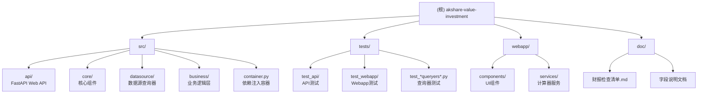

# CLAUDE.md - akshare-value-investment

## 变更记录 (Changelog)

### 2026-01-06 (架构初始化扫描) 🔍
- ✅ **AI上下文初始化**：完成全仓清点和模块识别
- ✅ **模块结构图**：生成 Mermaid 树形图，支持点击导航
- ✅ **模块级文档**：为每个核心模块生成独立的 CLAUDE.md
- ✅ **覆盖率报告**：统计项目文件、代码行数、测试覆盖率

### 2025-12-23 (架构简化) 🗑️
- ✅ **移除MCP模块**：删除MCP服务器和相关代码
- ✅ **移除缓存系统**：删除SQLite缓存和相关测试
- ✅ **专注核心**：保留FastAPI Web API和核心查询功能

### 2025-12-08 (FastAPI Web API) 🌐
- ✅ **FastAPI Web API**：10个财务查询端点，异步处理能力
- ✅ **财报检查清单**：跨市场字段映射，A股、港股、美股支持

### 2025-12-01 (SOLID架构优化) 🔧
- ✅ **美股查询器重构**：恢复基类架构，消除代码重复
- ✅ **港股字段修复**：修复REPORT_DATE字段缺失问题
- ✅ **测试完善**：188个测试全部通过，0失败0跳过

---

## 项目愿景

基于 akshare 的价值投资分析系统，提供跨市场（A股、港股、美股）财务指标查询和财务三表分析功能，专注于原始数据访问。

## 🏗️ 系统架构成果

### FastAPI Web API系统 🌐

**生产级Web API** - 基于FastAPI的现代Web服务：

- **RESTful API**：10个财务查询端点全覆盖
- **异步处理**：高性能异步处理能力
- **自动文档**：OpenAPI/Swagger自动生成
- **类型安全**：Pydantic模型验证和序列化
- **依赖注入**：FastAPI Depends与现有容器集成

**核心代码位置**：[`src/akshare_value_investment/api/`](src/akshare_value_investment/api/)

### 跨市场财务数据查询系统 ✅

**生产就绪的架构** - 专注于原始数据访问：

- **跨市场支持**：A股、港股、美股全覆盖
- **数据完整性**：100%字段覆盖率，直接访问akshare原始数据
- **SOLID架构**：基于设计模式的可扩展架构
- **统一接口**：跨市场统一查询接口

**核心代码位置**：[`src/akshare_value_investment/`](src/akshare_value_investment/)

### SOLID架构设计 ✅

**优雅的代码架构** - 基于SOLID原则的查询器设计：

- **模板方法模式**：BaseDataQueryer定义统一查询流程
- **继承多态**：美股查询器基类消除代码重复
- **策略模式**：不同市场实现不同数据获取策略
- **依赖注入**：dependency-injector容器管理

**核心代码位置**：[`src/akshare_value_investment/datasource/queryers/`](src/akshare_value_investment/datasource/queryers/)

### Streamlit Web应用 📊

**股票质量分析工具** - 基于Streamlit的数据可视化前端：

- **财务分析**：ROIC、EBIT利润率、营收增长、现金流分析
- **估值模型**：DCF估值、净利润估值
- **债务分析**：债务权益比、流动性比率、利息覆盖
- **智能识别**：自动识别股票代码所属市场

**核心代码位置**：[`webapp/`](webapp/)

## 📁 模块结构图



## 📊 模块索引

| 模块路径 | 语言 | 状态 | 描述 | 文档 |
|---------|------|------|------|------|
| `src/akshare_value_investment` | Python | ✅ 生产就绪 | 核心功能模块 | [CLAUDE.md](src/akshare_value_investment/CLAUDE.md) |
| `src/akshare_value_investment/api` | Python | ✅ 生产就绪 | FastAPI Web API | [CLAUDE.md](src/akshare_value_investment/api/CLAUDE.md) |
| `src/akshare_value_investment/core` | Python | ✅ 生产就绪 | 核心组件 | [CLAUDE.md](src/akshare_value_investment/core/CLAUDE.md) |
| `src/akshare_value_investment/datasource` | Python | ✅ 生产就绪 | 数据源查询器 | [CLAUDE.md](src/akshare_value_investment/datasource/CLAUDE.md) |
| `src/akshare_value_investment/business` | Python | ✅ 生产就绪 | 业务逻辑层 | [CLAUDE.md](src/akshare_value_investment/business/CLAUDE.md) |
| `webapp` | Python | ✅ 生产就绪 | Streamlit Web应用 | [CLAUDE.md](webapp/CLAUDE.md) |
| `tests` | Python | ✅ 生产就绪 | 测试套件 | [README.md](tests/README.md) |

## 💻 开发指南

### 环境要求
- Python >= 3.13
- uv 包管理器
- akshare >= 1.0.0
- dependency-injector >= 4.0.0

### 编码规范
- Python 3.13+ 特性
- 遵循 PEP 8
- 使用类型注解
- Google 风格文档字符串

### 核心开发原则
- **SOLID架构**：基于设计模式的可扩展架构
- **原始数据完整**：保留所有原始字段，用户自主选择
- **跨市场统一**：同一接口支持三地市场

## 🚀 快速开始

### 启动服务
```bash
# 启动 FastAPI 服务
poe api

# 启动 Streamlit Web应用
poe streamlit

# 或使用启动脚本（同时启动两个服务）
./start_services.sh
```

### 基本查询模式
```python
from akshare_value_investment.container import create_container

# 创建容器
container = create_container()

# 获取查询器
a_stock_queryer = container.a_stock_indicators()
hk_stock_queryer = container.hk_stock_indicators()
us_stock_queryer = container.us_stock_indicators()

# 执行查询
a_stock_data = a_stock_queryer.query("SH600519", "2023-01-01", "2023-12-31")
hk_stock_data = hk_stock_queryer.query("00700", "2023-01-01", "2023-12-31")
us_stock_data = us_stock_queryer.query("AAPL", "2023-01-01", "2023-12-31")
```

### 运行测试
```bash
# 运行所有测试
uv run pytest tests/

# 运行API测试
uv run pytest tests/api/

# 运行Webapp测试
uv run pytest tests/webapp/
```

## 📚 文档系统

### 核心文档
| 文档 | 描述 | 状态 |
|------|------|------|
| [doc/财报检查清单.md](doc/财报检查清单.md) | 财报分析 - 跨市场财报检查清单和字段映射 | ✅ 生产就绪 |
| [doc/a_stock_fields.md](doc/a_stock_fields.md) | A股字段 - A股财务指标完整字段说明 | ✅ 生产就绪 |
| [doc/hk_stock_fields.md](doc/hk_stock_fields.md) | 港股字段 - 港股财务指标完整字段说明 | ✅ 生产就绪 |
| [doc/us_stock_fields.md](doc/us_stock_fields.md) | 美股字段 - 美股财务指标完整字段说明 | ✅ 生产就绪 |
| [doc/ARCHITECTURE_REFACTOR_PLAN.md](doc/ARCHITECTURE_REFACTOR_PLAN.md) | 架构重构计划 - 核心库驱动架构设计 | ✅ 参考文档 |

## 📊 技术特性

### 工程化设计
- **Web API**：FastAPI异步处理，OpenAPI自动文档
- **依赖注入**：dependency-injector容器管理
- **SOLID架构**：基于设计模式的优雅架构
- **类型安全**：完整类型注解和Pydantic验证
- **测试驱动**：多层级测试覆盖

### 数据访问能力
- **100%字段覆盖**：财务指标 + 财务三表完整覆盖
- **原始数据保留**：直接访问所有原始字段
- **跨市场统一**：同一接口支持三地市场
- **智能格式转换**：窄表→宽表自动转换

### 测试覆盖
- **API测试**：FastAPI路由、模型、依赖注入测试
- **核心测试**：查询器测试、股票识别测试
- **集成测试**：API集成测试、Webapp组件测试

## AI 使用指引

### 架构理解
1. **项目定位**：这是一个"厚后端（Core Library），薄前端（WebApp）"的架构
2. **核心价值**：财务数据查询和标准化，而非UI渲染
3. **设计原则**：SOLID原则、依赖注入、跨市场统一

### 重构方向
参考 [doc/ARCHITECTURE_REFACTOR_PLAN.md](doc/ARCHITECTURE_REFACTOR_PLAN.md) 中的架构重构计划：
- **领域下沉**：将计算器逻辑移至 `src/domain/`
- **数据适配器**：建立 `src/datasource/adapters/` 进行数据标准化
- **前端瘦身**：`webapp/` 仅保留UI渲染逻辑

### 常见任务
1. **添加新查询器**：继承 `BaseDataQueryer`，实现 `_query_raw` 方法
2. **添加新API端点**：在 `src/akshare_value_investment/api/routes/` 中创建路由
3. **添加新分析指标**：在 `webapp/services/calculators/` 中创建计算器

---

**当前版本**：v1.0.0（FastAPI Web API核心版）
**核心特性**：Web API服务、跨市场财报分析、原始数据访问
**技术栈**：Python 3.13, FastAPI, akshare, dependency-injector, Streamlit
