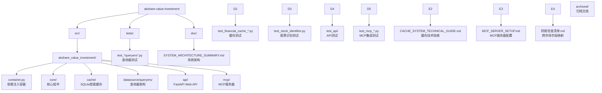

# CLAUDE.md - akshare-value-investment

## 项目愿景

基于 akshare 的价值投资分析系统，提供跨市场（A股、港股、美股）财务指标查询和财务三表分析功能，专注于原始数据访问和智能缓存。

## 🏗️ 系统架构成果

### FastAPI Web API系统 🌐

**生产级Web API** - 基于FastAPI的现代Web服务：

- **RESTful API**：10个财务查询端点全覆盖
- **异步处理**：高性能异步处理能力
- **自动文档**：OpenAPI/Swagger自动生成
- **类型安全**：Pydantic模型验证和序列化
- **依赖注入**：FastAPI Depends与现有容器集成

**核心代码位置**：[`src/akshare_value_investment/api/`](src/akshare_value_investment/api/)

### MCP-HTTP集成系统 🔗

**Model Context Protocol集成** - 基于HTTP的MCP服务：

- **HTTP客户端**：使用httpx进行HTTP调用
- **错误处理**：完整的HTTP状态码和错误转换
- **独立运行**：MCP服务器可独立启动
- **交互式控制台**：用户友好的命令行界面
- **配置管理**：环境变量和命令行参数支持

**核心代码位置**：[`src/akshare_value_investment/mcp/`](src/akshare_value_investment/mcp/)

### 跨市场财务数据查询系统 ✅

**生产就绪的架构** - 专注于原始数据访问和智能缓存：

- **跨市场支持**：A股、港股、美股全覆盖
- **数据完整性**：100%字段覆盖率，直接访问akshare原始数据
- **智能缓存**：SQLite智能缓存系统，API调用减少70%+
- **SOLID架构**：基于设计模式的可扩展架构
- **统一接口**：跨市场统一查询接口

**核心代码位置**：[`src/akshare_value_investment/`](src/akshare_value_investment/)

### SQLite智能缓存系统 🚀

**生产级缓存解决方案** - 专为财务数据查询设计：

- **智能增量更新**：自动识别缺失数据范围，API调用减少70%+
- **复合主键设计**：摒弃字符串cache_key，存储效率提升60%+
- **透明集成**：装饰器模式，现有代码无需修改即可获得缓存能力
- **线程安全保障**：支持高并发访问，查询速度提升50%+

**核心代码位置**：[`src/akshare_value_investment/cache/`](src/akshare_value_investment/cache/)

### SOLID架构设计 ✅

**优雅的代码架构** - 基于SOLID原则的查询器设计：

- **模板方法模式**：BaseDataQueryer定义统一查询流程
- **继承多态**：美股查询器基类消除代码重复
- **策略模式**：不同市场实现不同数据获取策略
- **依赖注入**：dependency-injector容器管理

**核心代码位置**：[`src/akshare_value_investment/datasource/queryers/`](src/akshare_value_investment/datasource/queryers/)

## 📁 项目结构



### 核心模块
| 模块路径 | 语言 | 状态 | 描述 |
|---------|------|------|------|
| `src/akshare_value_investment` | Python | ✅ 生产就绪 | 核心功能模块 |

### 核心文件
| 文件 | 描述 | 状态 |
|------|------|------|
| [`container.py`](src/akshare_value_investment/container.py) | **依赖注入容器** - dependency-injector配置 | ✅ 生产就绪 |
| [`api/main.py`](src/akshare_value_investment/api/main.py) | **FastAPI应用** - Web API入口和路由注册 | ✅ 生产就绪 |
| [`mcp/server.py`](src/akshare_value_investment/mcp/server.py) | **MCP服务器** - Model Context Protocol服务 | ✅ 生产就绪 |
| [`core/stock_identifier.py`](src/akshare_value_investment/core/stock_identifier.py) | **股票识别器** - 跨市场股票代码识别 | ✅ 生产就绪 |
| [`core/models.py`](src/akshare_value_investment/core/models.py) | **数据模型** - 市场类型定义 | ✅ 生产就绪 |
| [`cache/sqlite_cache.py`](src/akshare_value_investment/cache/sqlite_cache.py) | **SQLite缓存** - 智能缓存实现 | ✅ 生产就绪 |
| [`cache/smart_decorator.py`](src/akshare_value_investment/cache/smart_decorator.py) | **缓存装饰器** - 透明缓存集成 | ✅ 生产就绪 |

#### 查询器架构
| 文件 | 描述 | 状态 |
|------|------|------|
| [`datasource/queryers/base_queryer.py`](src/akshare_value_investment/datasource/queryers/base_queryer.py) | **查询器基类** - 模板方法模式 | ✅ 生产就绪 |
| [`datasource/queryers/a_stock_queryers.py`](src/akshare_value_investment/datasource/queryers/a_stock_queryers.py) | **A股查询器** - 同花顺数据源 | ✅ 生产就绪 |
| [`datasource/queryers/hk_stock_queryers.py`](src/akshare_value_investment/datasource/queryers/hk_stock_queryers.py) | **港股查询器** - 东方财富数据源 | ✅ 生产就绪 |
| [`datasource/queryers/us_stock_queryers.py`](src/akshare_value_investment/datasource/queryers/us_stock_queryers.py) | **美股查询器** - 东方财富数据源 | ✅ 生产就绪 |

## 📚 文档系统

### 🎯 核心文档
| 文档 | 描述 | 状态 |
|------|------|------|
| [doc/SYSTEM_ARCHITECTURE_SUMMARY.md](./doc/SYSTEM_ARCHITECTURE_SUMMARY.md) | **系统架构** - 智能财务查询系统架构总结 | ✅ 当前版本 |
| [doc/CACHE_SYSTEM_TECHNICAL_GUIDE.md](./doc/CACHE_SYSTEM_TECHNICAL_GUIDE.md) | **缓存系统** - SQLite智能缓存技术指南 | ✅ 生产就绪 |
| [doc/MCP_SERVER_SETUP.md](./doc/MCP_SERVER_SETUP.md) | **MCP配置** - MCP服务器配置和使用指南 | ✅ 生产就绪 |
| [doc/财报检查清单.md](./doc/财报检查清单.md) | **财报分析** - 跨市场财报检查清单和字段映射 | ✅ 生产就绪 |

### 🗂️ 归档文档
| 文档 | 描述 | 状态 |
|------|------|------|
| [doc/archived/](./doc/archived/) | **归档文档** - 过时的设计方案和架构文档 | 📁 历史记录 |

## 💻 开发指南

### 环境要求
- Python >= 3.13
- uv 包管理器
- akshare >= 1.0.0
- dependency-injector >= 4.0.0

### 编码规范
- Python 3.13+ 特性
- 遵循 PEP 8
- 使用类型注解
- Google 风格文档字符串

### 核心开发原则
- **SOLID架构**：基于设计模式的可扩展架构
- **智能缓存**：透明的缓存机制，提升性能
- **原始数据完整**：保留所有原始字段，用户自主选择
- **跨市场统一**：同一接口支持三地市场

## 🚀 快速开始

### FastAPI Web API使用
```bash
# 启动 FastAPI 服务
poe api

# 访问 API 文档
# http://localhost:8000/docs
# http://localhost:8000/redoc
```

### MCP服务器使用
```bash
# 启动 MCP 服务器（交互式）
poe mcp

# 启动调试模式
poe mcp-debug

# 或使用启动脚本
./start_mcp.sh
```

### 基本查询模式
```python
from akshare_value_investment.container import create_container

# 创建容器
container = create_container()

# 获取查询器
a_stock_queryer = container.a_stock_indicators()
hk_stock_queryer = container.hk_stock_indicators()
us_stock_queryer = container.us_stock_indicators()

# 执行查询
a_stock_data = a_stock_queryer.query("SH600519", "2023-01-01", "2023-12-31")
hk_stock_data = hk_stock_queryer.query("00700", "2023-01-01", "2023-12-31")
us_stock_data = us_stock_queryer.query("AAPL", "2023-01-01", "2023-12-31")
```

### 财务三表查询
```python
# A股财务三表
a_balance = container.a_stock_balance_sheet()
a_income = container.a_stock_income_statement()
a_cashflow = container.a_stock_cash_flow()

# 港股财务三表 (窄表→宽表自动转换)
hk_statements = container.hk_stock_statement()

# 美股财务三表 (窄表→宽表自动转换)
us_balance = container.us_stock_balance_sheet()
us_income = container.us_stock_income_statement()
us_cashflow = container.us_stock_cash_flow()
```

### SQLite智能缓存使用
```python
from akshare_value_investment.cache import SQLiteCache, smart_sqlite_cache

# 创建缓存实例
cache = SQLiteCache(db_path=".cache/financial_data.db")

# 应用装饰器
@smart_sqlite_cache(
    date_field='date',
    query_type='indicators',
    cache_adapter=cache
)
def get_financial_data(symbol, start_date, end_date):
    return akshare_api_call(symbol)

# 使用 - 透明缓存
data1 = get_financial_data("SH600519", "2023-01-01", "2023-12-31")  # 首次查询，调用API
data2 = get_financial_data("SH600519", "2023-01-01", "2023-12-31")  # 重复查询，使用缓存
```

### 运行测试
```bash
# 运行所有测试
uv run pytest tests/

# 运行API测试
uv run pytest tests/api/

# 运行MCP集成测试
uv run pytest tests/test_mcp_*.py

# 运行缓存业务场景测试
uv run pytest tests/test_financial_cache_business_scenarios.py
```

## 📊 技术特性

### 工程化设计
- **Web API**：FastAPI异步处理，OpenAPI自动文档
- **MCP集成**：HTTP客户端，完整错误处理
- **依赖注入**：dependency-injector容器管理
- **SOLID架构**：基于设计模式的优雅架构
- **类型安全**：完整类型注解和Pydantic验证
- **测试驱动**：多层级测试覆盖，包含API和MCP测试

### SQLite智能缓存优势
- **API调用减少70%+**：智能增量更新避免重复请求
- **查询速度提升50%+**：SQL范围查询优于多次键值查询
- **存储效率提升60%+**：按条精确缓存，无冗余字段
- **线程安全保障**：高并发访问数据一致性
- **透明集成**：装饰器模式，现有代码无需修改

### 数据访问能力
- **100%字段覆盖**：财务指标 + 财务三表完整覆盖
- **原始数据保留**：直接访问所有原始字段
- **跨市场统一**：同一接口支持三地市场
- **智能格式转换**：窄表→宽表自动转换

### 测试覆盖
- **API测试**：FastAPI路由、模型、依赖注入测试
- **MCP测试**：HTTP集成、工具类、交互式测试
- **核心测试**：查询器测试、缓存测试、股票识别测试
- **集成测试**：缓存系统和API集成测试
- **业务场景测试**：6大业务场景完整验证

## 📈 变更记录

### 2025-12-08 (FastAPI与MCP集成) 🚀
- ✅ **FastAPI Web API**：10个财务查询端点，异步处理能力
- ✅ **MCP-HTTP集成**：MCP工具改为HTTP调用FastAPI服务
- ✅ **财报检查清单**：跨市场字段映射，A股、港股、美股支持
- ✅ **完整测试覆盖**：API测试、MCP集成测试、HTTP客户端测试
- ✅ **配置完善**：pyproject.toml任务配置，环境变量管理

### 2025-12-01 (SOLID架构优化) 🔧
- ✅ **美股查询器重构**：恢复基类架构，消除代码重复
- ✅ **港股字段修复**：修复REPORT_DATE字段缺失问题
- ✅ **测试完善**：188个测试全部通过，0失败0跳过
- ✅ **文档更新**：更新系统架构文档，删除过时内容

### 2025-11-13 (SQLite智能缓存系统) 🚀
- ✅ **架构重构**：采用复合主键设计，摒弃字符串cache_key冗余存储
- ✅ **智能增量更新**：实现6种数据缺失场景的智能处理算法
- ✅ **装饰器模式**：透明集成缓存功能，现有代码无需修改
- ✅ **业务场景验证**：完整测试覆盖，包含三边缺失等复杂场景

### 2025-11-10 (简化版架构完成) ✅
- ✅ **简化版完成**：专注原始数据访问，100%字段覆盖
- ✅ **测试优化**：188个测试用例全部通过
- ✅ **项目结构**：专业化的项目结构

---

**当前版本**：v3.0.0（FastAPI与MCP集成）
**核心特性**：Web API服务、MCP-HTTP集成、跨市场财报分析
**技术栈**：Python 3.13, FastAPI, httpx, akshare, dependency-injector, SQLite