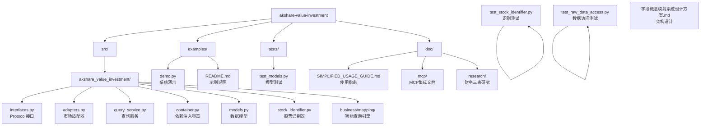

# CLAUDE.md - akshare-value-investment

## 项目愿景

基于 akshare 的价值投资分析系统，提供跨市场（A股、港股、美股）财务指标查询和财务三表分析功能，支持自然语言智能查询。

## 🏗️ 系统架构成果

### 财务指标查询系统 ✅

**生产就绪的架构** - 专注于原始数据访问和智能查询：

- **智能字段映射**：195个财务指标字段，支持自然语言查询
- **跨市场支持**：A股(67字段)、港股(36字段)、美股(49字段)
- **YAML配置驱动**：平均每个字段8个中文关键字映射
- **MCP集成**：完全集成Claude Code环境，支持智能字段映射查询
- **原始数据访问**：100%字段覆盖率，通过`raw_data`直接访问

**核心代码位置**：[`src/akshare_value_investment/`](src/akshare_value_investment/)

### 财务三表扩展 🚀

**重大发现**：系统已具备完整的自然语言查询基础设施，财务三表扩展只需配置扩展：

- **零代码修改**：完全复用现有查询引擎和映射器
- **配置扩展即可**：添加300+财务三表字段到YAML配置
- **立即可用**：配置完成后支持"总资产"、"营业收入"等自然语言查询
- **实施简化**：从15-20天开发缩短至3-5天配置

## 📁 项目结构



### 核心模块
| 模块路径 | 语言 | 状态 | 描述 |
|---------|------|------|------|
| `src/akshare_value_investment` | Python | ✅ 生产就绪 | 核心功能模块 |

### 核心文件
| 文件 | 描述 | 状态 |
|------|------|------|
| [`interfaces.py`](src/akshare_value_investment/interfaces.py) | **Protocol接口** - 核心接口定义 | ✅ 生产就绪 |
| [`adapters.py`](src/akshare_value_investment/adapters.py) | **市场适配器** - 三地市场数据获取 | ✅ 生产就绪 |
| [`query_service.py`](src/akshare_value_investment/query_service.py) | **查询服务** - 统一查询接口 | ✅ 生产就绪 |
| [`container.py`](src/akshare_value_investment/container.py) | **依赖注入** - dependency-injector容器 | ✅ 生产就绪 |
| [`models.py`](src/akshare_value_investment/models.py) | **数据模型** - 包含`raw_data`字段 | ✅ 生产就绪 |
| [`business/mapping/query_engine.py`](src/akshare_value_investment/business/mapping/query_engine.py) | **智能查询引擎** - 自然语言查询 | ✅ 生产就绪 |
| [`business/mapping/field_mapper.py`](src/akshare_value_investment/business/mapping/field_mapper.py) | **字段映射器** - 智能字段映射 | ✅ 生产就绪 |
| [`datasource/config/financial_indicators.yaml`](src/akshare_value_investment/datasource/config/financial_indicators.yaml) | **字段配置** - 195个字段映射配置 | ✅ 生产就绪 |

## 📚 文档系统

### 🎯 核心文档
| 文档 | 描述 | 状态 |
|------|------|------|
| [doc/SIMPLIFIED_USAGE_GUIDE.md](./doc/SIMPLIFIED_USAGE_GUIDE.md) | **完整使用指南** - 系统使用方法和API | ✅ 当前版本 |
| [doc/mcp/](./doc/mcp/) | **MCP集成文档** - Claude Code集成指南 | ✅ 生产就绪 |
| [doc/research/](./doc/research/) | **财务三表研究** - 扩展方案和配置 | 📋 最新研究 |

### 🔬 研究文档
| 文档 | 描述 | 状态 |
|------|------|------|
| [doc/research/FINAL_RESEARCH_SUMMARY.md](./doc/research/FINAL_RESEARCH_SUMMARY.md) | **研究总结** - 三地市场API分析和方案 | ✅ 最新发现 |
| [doc/research/financial_statements_config_extension.md](./doc/research/financial_statements_config_extension.md) | **配置方案** - 300+字段具体配置 | 📝 实施指南 |
| [doc/research/architecture_refactoring_plan.md](./doc/research/architecture_refactoring_plan.md) | **重构计划** - 重大调整后的实施方案 | 📋 架构设计 |

### 🏗️ 架构设计
| 文档 | 描述 | 状态 |
|------|------|------|
| [doc/字段概念映射系统设计方案.md](./doc/字段概念映射系统设计方案.md) | **架构设计** - 自然语言查询系统设计 | 📋 设计方案 |
| [doc/SOLID_REFACTORING_SUMMARY.md](./doc/SOLID_REFACTORING_SUMMARY.md) | **重构总结** - SOLID原则架构优化 | ✅ 已完成 |

## 💻 开发指南

### 环境要求
- Python >= 3.13
- uv 包管理器
- akshare >= 1.0.0
- dependency-injector >= 4.0.0

### 编码规范
- Python 3.13+ 特性
- 遵循 PEP 8
- 使用类型注解
- Google 风格文档字符串

### 核心开发原则
- **智能查询优先**：支持自然语言查询，用户体验友好
- **配置驱动**：通过YAML配置扩展字段，无需代码修改
- **架构优雅**：依赖注入、Protocol接口、SOLID原则
- **原始数据完整**：保留所有原始字段，用户自主选择

## 🚀 快速开始

### 运行演示
```bash
# 运行系统演示
uv run python examples/demo.py

# 运行测试
uv run pytest tests/

# MCP集成测试
uv run python -m akshare_value_investment.mcp.server
```

### 自然语言查询示例
```python
from akshare_value_investment.business.mapping.query_engine import FinancialQueryEngine

engine = FinancialQueryEngine()

# 财务指标查询（已实现）
result1 = engine.query_financial_field("ROE", "a_stock")        # 净资产收益率
result2 = engine.query_financial_field("每股收益", "a_stock")   # 基本每股收益

# 财务三表查询（配置扩展后可用）
result3 = engine.query_financial_field("总资产", "a_stock")     # 资产负债表-总资产
result4 = engine.query_financial_field("营业收入", "a_stock")   # 利润表-营业收入
result5 = engine.query_financial_field("经营现金流", "a_stock") # 现金流量表-经营现金流
```

### MCP环境使用
在Claude Code中直接使用：
```bash
# 搜索财务字段
/search_financial_fields keyword="ROE" market="a_stock"

# 查询财务数据
/query_financial_data symbol="SH600519" query="净利润" start_date="2023-01-01"
```

## 📊 技术特性

### 工程化设计
- **依赖注入**：dependency-injector容器管理
- **接口设计**：Protocol接口，I前缀命名
- **类型安全**：Decimal精确计算，完整类型注解
- **配置驱动**：YAML配置文件，热加载支持

### 智能查询能力
- **自然语言支持**：195个字段，平均8个中文关键字
- **相似度计算**：精确匹配、包含匹配、模糊匹配
- **跨市场统一**：同一接口支持三地市场
- **MCP集成**：完全集成Claude Code环境

### 数据访问优势
- **100%字段覆盖**：财务指标195个字段 + 财务三表300+字段（配置后）
- **原始数据保留**：通过`raw_data`访问所有原始字段
- **无映射限制**：用户可直接访问任意原始字段
- **市场适配**：不同市场使用原生字段名

### 测试覆盖
- **总测试数**：19个测试用例，100%通过
- **核心测试**：模型测试、股票识别、数据访问测试
- **架构测试**：SOLID原则验证测试
- **集成测试**：MCP集成和端到端测试

## 📈 变更记录

### 2025-11-12 (MCP智能查询修复) 🔧
- ✅ **根本问题解决**：修复MCP查询失败，集成智能字段映射系统
- ✅ **查询功能恢复**：支持自然语言查询，如"营收"、"净利润"等
- ✅ **搜索功能优化**：返回真实搜索结果，包含相似度和字段详情
- ✅ **验证测试**：贵州茅台、五粮液、长江电力查询验证成功
- ✅ **性能提升**：从简化字符串匹配升级为智能映射算法

### 2025-11-12 (财务三表扩展发现) 🚀
- ✅ **重大发现**：系统已具备完整的自然语言查询基础设施
- ✅ **方案调整**：从15-20天开发缩短至3-5天配置扩展
- ✅ **零代码修改**：完全复用现有架构，配置扩展即可
- ✅ **研究完成**：三地市场财务三表API研究完成
- ✅ **文档整理**：统一文档结构，删除过时内容

### 2025-11-11 (SOLID架构优化)
- ✅ **架构重构**：基于SOLID原则的架构优化
- ✅ **智能查询**：自然语言查询引擎实现
- ✅ **字段映射**：195个字段的智能映射配置
- ✅ **MCP集成**：Claude Code环境完全集成

### 2025-11-10 (简化版架构完成)
- ✅ **简化版完成**：专注原始数据访问，100%字段覆盖
- ✅ **测试优化**：19个测试用例全部通过
- ✅ **文档更新**：简化版使用指南
- ✅ **项目结构**：专业化的项目结构

## 🎯 下一步计划

### 财务三表配置扩展（3-5天）
1. **配置扩展**：添加300+财务三表字段到YAML配置
2. **API集成**：适配现有适配器支持财务三表API
3. **测试验证**：端到端功能验证

### 功能增强
1. **更多字段**：继续扩展更多财务分析字段
2. **智能分析**：基于查询结果的智能分析建议
3. **可视化**：财务数据可视化展示
4. **性能优化**：缓存机制和异步处理

---

**当前版本**：v2.0.0（智能查询架构）
**下一个里程碑**：财务三表配置扩展完成
**技术栈**：Python 3.13, akshare, dependency-injector, MCP