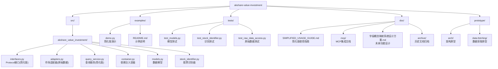

# CLAUDE.md - akshare-value-investment

## 项目愿景

基于 akshare 的价值投资分析系统，提供跨市场（A股、港股、美股）财务指标原始数据访问功能。

## 🏗️ 简化版架构成果

### 财务指标查询系统 - 简化版 ✅

**生产就绪的简化版架构** - 专注于原始数据访问，100%字段覆盖率：

- **简化设计**：直接返回akshare原始数据，不进行字段映射
- **完整覆盖**：用户可访问所有原始字段（A股86个，港股36个，美股49个）
- **优雅架构**：保留依赖注入和Protocol接口的优秀设计
- **易于使用**：通过`FinancialIndicator.raw_data`直接访问任意字段

**核心代码位置**：[`src/akshare_value_investment/`](src/akshare_value_investment/)

**快速体验**：
```bash
# 运行简化版演示
uv run python examples/demo.py

# 运行测试
uv run pytest tests/
```

## 📁 项目结构



### 核心模块
| 模块路径 | 语言 | 状态 | 描述 |
|---------|------|------|------|
| `src/akshare_value_investment` | Python | ✅ 生产就绪 | 简化版核心功能模块 |

### 简化版核心文件
| 文件 | 描述 | 状态 |
|------|------|------|
| [`interfaces.py`](src/akshare_value_investment/interfaces.py) | **Protocol接口** - 简化版，移除字段映射 | ✅ 生产就绪 |
| [`adapters.py`](src/akshare_value_investment/adapters.py) | **市场适配器** - 直接返回原始数据 | ✅ 生产就绪 |
| [`query_service.py`](src/akshare_value_investment/query_service.py) | **查询服务** - 简化版查询逻辑 | ✅ 生产就绪 |
| [`container.py`](src/akshare_value_investment/container.py) | **依赖注入** - dependency-injector容器 | ✅ 生产就绪 |
| [`models.py`](src/akshare_value_investment/models.py) | **数据模型** - 包含`raw_data`字段 | ✅ 生产就绪 |
| [`stock_identifier.py`](src/akshare_value_investment/stock_identifier.py) | **股票识别** - 市场类型识别 | ✅ 生产就绪 |

### 历史原型
- `prototype/data-fetching/` - akshare 数据获取原型（保留参考）
- `prototype/arch/` - 早期架构原型（已迁移至简化版）

## 📚 文档系统

### 核心文档
| 文档 | 描述 | 状态 |
|------|------|------|
| [doc/SIMPLIFIED_USAGE_GUIDE.md](./doc/SIMPLIFIED_USAGE_GUIDE.md) | **简化版完整使用指南** - 100%字段覆盖，原始数据访问 | ✅ 当前版本 |
| [doc/mcp/](./doc/mcp/) | **MCP集成文档** - Claude Code集成指南和配置 | ✅ 生产就绪 |
| [doc/字段概念映射系统设计方案.md](./doc/字段概念映射系统设计方案.md) | **未来功能设计** - 自然语言查询财务概念 | 📋 设计方案 |

### 历史文档（已归档）
| 目录 | 描述 | 状态 | 备注 |
|------|------|------|------|
| [doc/archive/](./doc/archive/) | **历史文档归档** - 包含项目总结、配置记录等过程文档 | 📜 已归档 | 仅作参考，不适用于当前版本 |

## 💻 开发指南

### 环境要求
- Python >= 3.13
- uv 包管理器
- akshare >= 1.0.0
- dependency-injector >= 4.0.0

### 编码规范
- Python 3.13+ 特性
- 遵循 PEP 8
- 使用类型注解
- Google 风格文档字符串

### 核心开发原则
- **简化优先**：避免过度设计，保持架构简洁
- **原始数据**：直接返回akshare原始数据，不进行字段映射
- **用户灵活**：用户通过`raw_data`自主选择需要的字段
- **优雅设计**：保留依赖注入和Protocol接口的优秀模式

## 📊 简化版技术特性

### 工程化设计
- **依赖注入**：使用 dependency-injector 开源框架
- **接口设计**：Protocol接口，I前缀命名，最小化设计
- **类型安全**：Decimal精确财务计算，完整类型注解
- **真实数据**：直接使用akshare真实财务数据

### 字段访问优势
- **100%覆盖率**：A股86个字段，港股36个字段，美股49个字段
- **无映射限制**：用户可直接访问任意原始字段
- **市场适配**：不同市场使用原生字段名，保持原始性
- **灵活选择**：用户根据需求自主使用字段

### 测试覆盖
- **总测试数**：19个测试用例，100%通过
- **核心测试**：模型测试(5个)、股票识别(6个)、原始数据访问(8个)
- **无跳过测试**：所有测试都与简化版功能相关
- **覆盖范围**：核心功能全覆盖，质量保障

## 📈 变更记录

### 2025-11-10 (简化版完成)
- ✅ **简化版架构完成** - 移除字段映射，专注原始数据访问
- ✅ **100%字段覆盖** - A股86个、港股36个、美股49个字段，全部可访问
- ✅ **测试优化完成** - 19个测试用例全部通过，无跳过测试
- ✅ **文档更新** - 更新为简化版使用指南，移除过时内容
- ✅ **项目结构优化** - demo移至examples目录，结构更专业

### 2025-11-10 (架构演进)
- ✅ 复杂字段映射架构设计
- ✅ 原始数据分析和字段映射
- ✅ TDD开发，72个测试用例
- ✅ 依赖注入和Protocol接口实现

### 2025-11-10 16:12:35 (项目初始化)
- 初始化项目文档结构
- 发现项目处于初期开发阶段