# CLAUDE.md - akshare-value-investment

## 项目愿景

基于 akshare 的价值投资分析系统，提供跨市场（A股、港股、美股）财务指标查询和财务三表分析功能，专注于原始数据访问。

## 🏗️ 系统架构成果

### FastAPI Web API系统 🌐

**生产级Web API** - 基于FastAPI的现代Web服务：

- **RESTful API**：10个财务查询端点全覆盖
- **异步处理**：高性能异步处理能力
- **自动文档**：OpenAPI/Swagger自动生成
- **类型安全**：Pydantic模型验证和序列化
- **依赖注入**：FastAPI Depends与现有容器集成

**核心代码位置**：[`src/akshare_value_investment/api/`](src/akshare_value_investment/api/)

### 跨市场财务数据查询系统 ✅

**生产就绪的架构** - 专注于原始数据访问：

- **跨市场支持**：A股、港股、美股全覆盖
- **数据完整性**：100%字段覆盖率，直接访问akshare原始数据
- **SOLID架构**：基于设计模式的可扩展架构
- **统一接口**：跨市场统一查询接口

**核心代码位置**：[`src/akshare_value_investment/`](src/akshare_value_investment/)

### SOLID架构设计 ✅

**优雅的代码架构** - 基于SOLID原则的查询器设计：

- **模板方法模式**：BaseDataQueryer定义统一查询流程
- **继承多态**：美股查询器基类消除代码重复
- **策略模式**：不同市场实现不同数据获取策略
- **依赖注入**：dependency-injector容器管理

**核心代码位置**：[`src/akshare_value_investment/datasource/queryers/`](src/akshare_value_investment/datasource/queryers/)

## 📁 项目结构

```mermaid
graph TD
    A["akshare-value-investment"] --> B["src/"]
    A --> D["tests/"]
    A --> E["doc/"]

    B --> B1["akshare_value_investment/"]
    B1 --> B1a["container.py<br/>依赖注入容器"]
    B1 --> B1b["core/<br/>核心组件"]
    B1 --> B1c["datasource/queryers/<br/>查询器架构"]
    B1 --> B1d["api/<br/>FastAPI Web API"]
    B1 --> B1e["business/<br/>业务逻辑层"]

    D --> D1["test_*queryers*.py<br/>查询器测试"]
    D2 --> D2a["test_stock_identifier.py<br/>股票识别测试"]
    D4 --> D4a["test_api/<br/>API测试"]

    E --> E1["a_stock_fields.md<br/>A股字段说明"]
    E2 --> E2a["财报检查清单.md<br/>跨市场字段映射"]
    E3 --> E3b["hk_stock_fields.md<br/>港股字段"]
    E4 --> E4a["us_stock_fields.md<br/>美股字段"]
```



### 核心模块
| 模块路径 | 语言 | 状态 | 描述 |
|---------|------|------|------|
| `src/akshare_value_investment` | Python | ✅ 生产就绪 | 核心功能模块 |

### 核心文件
| 文件 | 描述 | 状态 |
|------|------|------|
| [`container.py`](src/akshare_value_investment/container.py) | **依赖注入容器** - dependency-injector配置 | ✅ 生产就绪 |
| [`api/main.py`](src/akshare_value_investment/api/main.py) | **FastAPI应用** - Web API入口和路由注册 | ✅ 生产就绪 |
| [`core/stock_identifier.py`](src/akshare_value_investment/core/stock_identifier.py) | **股票识别器** - 跨市场股票代码识别 | ✅ 生产就绪 |
| [`core/models.py`](src/akshare_value_investment/core/models.py) | **数据模型** - 市场类型定义 | ✅ 生产就绪 |

#### 查询器架构
| 文件 | 描述 | 状态 |
|------|------|------|
| [`datasource/queryers/base_queryer.py`](src/akshare_value_investment/datasource/queryers/base_queryer.py) | **查询器基类** - 模板方法模式 | ✅ 生产就绪 |
| [`datasource/queryers/a_stock_queryers.py`](src/akshare_value_investment/datasource/queryers/a_stock_queryers.py) | **A股查询器** - 同花顺数据源 | ✅ 生产就绪 |
| [`datasource/queryers/hk_stock_queryers.py`](src/akshare_value_investment/datasource/queryers/hk_stock_queryers.py) | **港股查询器** - 东方财富数据源 | ✅ 生产就绪 |
| [`datasource/queryers/us_stock_queryers.py`](src/akshare_value_investment/datasource/queryers/us_stock_queryers.py) | **美股查询器** - 东方财富数据源 | ✅ 生产就绪 |

## 📚 文档系统

### 🎯 核心文档
| 文档 | 描述 | 状态 |
|------|------|------|
| [doc/财报检查清单.md](./doc/财报检查清单.md) | **财报分析** - 跨市场财报检查清单和字段映射 | ✅ 生产就绪 |
| [doc/a_stock_fields.md](./doc/a_stock_fields.md) | **A股字段** - A股财务指标完整字段说明 | ✅ 生产就绪 |
| [doc/hk_stock_fields.md](./doc/hk_stock_fields.md) | **港股字段** - 港股财务指标完整字段说明 | ✅ 生产就绪 |
| [doc/us_stock_fields.md](./doc/us_stock_fields.md) | **美股字段** - 美股财务指标完整字段说明 | ✅ 生产就绪 |

## 💻 开发指南

### 环境要求
- Python >= 3.13
- uv 包管理器
- akshare >= 1.0.0
- dependency-injector >= 4.0.0

### 编码规范
- Python 3.13+ 特性
- 遵循 PEP 8
- 使用类型注解
- Google 风格文档字符串

### 核心开发原则
- **SOLID架构**：基于设计模式的可扩展架构
- **原始数据完整**：保留所有原始字段，用户自主选择
- **跨市场统一**：同一接口支持三地市场

## 🚀 快速开始

### FastAPI Web API使用
```bash
# 启动 FastAPI 服务
poe api

# 访问 API 文档
# http://localhost:8000/docs
# http://localhost:8000/redoc
```

### 基本查询模式
```python
from akshare_value_investment.container import create_container

# 创建容器
container = create_container()

# 获取查询器
a_stock_queryer = container.a_stock_indicators()
hk_stock_queryer = container.hk_stock_indicators()
us_stock_queryer = container.us_stock_indicators()

# 执行查询
a_stock_data = a_stock_queryer.query("SH600519", "2023-01-01", "2023-12-31")
hk_stock_data = hk_stock_queryer.query("00700", "2023-01-01", "2023-12-31")
us_stock_data = us_stock_queryer.query("AAPL", "2023-01-01", "2023-12-31")
```

### 财务三表查询
```python
# A股财务三表
a_balance = container.a_stock_balance_sheet()
a_income = container.a_stock_income_statement()
a_cashflow = container.a_stock_cash_flow()

# 港股财务三表 (窄表→宽表自动转换)
hk_statements = container.hk_stock_statement()

# 美股财务三表 (窄表→宽表自动转换)
us_balance = container.us_stock_balance_sheet()
us_income = container.us_stock_income_statement()
us_cashflow = container.us_stock_cash_flow()
```

### 运行测试
```bash
# 运行所有测试
uv run pytest tests/

# 运行API测试
uv run pytest tests/api/
```

## 📊 技术特性

### 工程化设计
- **Web API**：FastAPI异步处理，OpenAPI自动文档
- **依赖注入**：dependency-injector容器管理
- **SOLID架构**：基于设计模式的优雅架构
- **类型安全**：完整类型注解和Pydantic验证
- **测试驱动**：多层级测试覆盖

### 数据访问能力
- **100%字段覆盖**：财务指标 + 财务三表完整覆盖
- **原始数据保留**：直接访问所有原始字段
- **跨市场统一**：同一接口支持三地市场
- **智能格式转换**：窄表→宽表自动转换

### 测试覆盖
- **API测试**：FastAPI路由、模型、依赖注入测试
- **核心测试**：查询器测试、股票识别测试
- **集成测试**：API集成测试

## 📈 变更记录

### 2025-12-23 (架构简化) 🗑️
- ✅ **移除MCP模块**：删除MCP服务器和相关代码
- ✅ **移除缓存系统**：删除SQLite缓存和相关测试
- ✅ **专注核心**：保留FastAPI Web API和核心查询功能
- ✅ **清理依赖**：移除MCP和缓存相关依赖包
- ✅ **文档更新**：更新CLAUDE.md和项目文档

### 2025-12-08 (FastAPI Web API) 🌐
- ✅ **FastAPI Web API**：10个财务查询端点，异步处理能力
- ✅ **财报检查清单**：跨市场字段映射，A股、港股、美股支持
- ✅ **完整测试覆盖**：API测试、HTTP客户端测试
- ✅ **配置完善**：pyproject.toml任务配置，环境变量管理

### 2025-12-01 (SOLID架构优化) 🔧
- ✅ **美股查询器重构**：恢复基类架构，消除代码重复
- ✅ **港股字段修复**：修复REPORT_DATE字段缺失问题
- ✅ **测试完善**：188个测试全部通过，0失败0跳过
- ✅ **文档更新**：更新系统架构文档，删除过时内容

### 2025-11-10 (简化版架构完成) ✅
- ✅ **简化版完成**：专注原始数据访问，100%字段覆盖
- ✅ **测试优化**：188个测试用例全部通过
- ✅ **项目结构**：专业化的项目结构

---

**当前版本**：v1.0.0（FastAPI Web API核心版）
**核心特性**：Web API服务、跨市场财报分析、原始数据访问
**技术栈**：Python 3.13, FastAPI, akshare, dependency-injector
