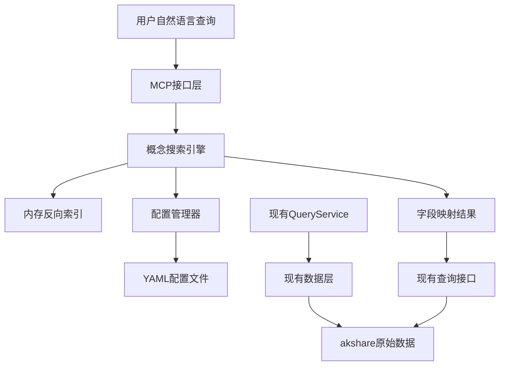

# 字段概念映射系统设计方案

## 1. 项目背景与目标

### 现状分析
- **现有系统优势**：简化版架构稳定运行，MCP集成成熟，可直接获取A股、港股、美股财务数据
- **用户痛点**：需要了解具体字段名，缺乏自然语言查询支持，跨市场字段命名差异大
- **核心需求**：通过中文自然语言查询找到对应市场的精准字段名

### 设计目标
- **LLM友好**：支持自然语言查询，返回结构化结果
- **易于维护**：配置驱动，无需修改代码即可添加新概念
- **轻量集成**：不破坏现有架构，渐进式增强
- **跨市场统一**：同一概念在不同市场都能找到对应字段

## 2. 架构设计

### 整体架构图


### 核心组件
1. **概念搜索引擎**：负责中文到字段的匹配和搜索
2. **配置管理器**：负责YAML配置文件的加载、缓存和重载
3. **内存反向索引**：提供快速的关键词搜索能力
4. **MCP工具接口**：暴露新的搜索和重载功能

## 3. YAML数据结构设计

### 主配置文件：financial_concepts.yaml

```yaml
version: "1.0.0"
last_updated: "2025-01-11"

# 概念定义层
concepts:
  eps:
    # 基本信息
    name: "每股收益"
    aliases:
      - "基本每股收益"
      - "摊薄每股收益"
      - "EPS"
      - "每股盈利"
    keywords:
      - "每股"
      - "收益"
      - "盈利"
      - "EPS"

    # 分类信息
    category: "盈利能力"
    importance: "高"
    description: "公司每股股票的盈利金额"

    # 市场映射 - 这是关键！
    market_mappings:
      a_stock:
        fields:
          - name: "摊薄每股收益(元)"
            unit: "元"
            priority: 1  # 优先级
          - name: "加权每股收益(元)"
            unit: "元"
            priority: 2
        notes: "A股有摊薄和加权两种EPS"

      hk_stock:
        fields:
          - name: "BASIC_EPS"
            unit: "港元"
            priority: 1
          - name: "DILUTED_EPS"
            unit: "港元"
            priority: 2
        notes: "港股主要使用BASIC_EPS"

      us_stock:
        fields:
          - name: "BASIC_EPS"
            unit: "美元"
            priority: 1
          - name: "DILUTED_EPS"
            unit: "美元"
            priority: 2

  roe:
    name: "净资产收益率"
    aliases: ["ROE", "股东权益回报率", "净值收益率"]
    keywords: ["净资产", "股东权益", "收益率", "ROE"]
    category: "盈利能力"
    importance: "高"
    description: "净利润与平均股东权益的比率"

    market_mappings:
      a_stock:
        fields:
          - name: "净资产收益率(%)"
            unit: "%"
            priority: 1
      hk_stock:
        fields:
          - name: "ROE_AVG"
            unit: "%"
            priority: 1
          - name: "ROE_YEARLY"
            unit: "%"
            priority: 2
      us_stock:
        fields:
          - name: "ROE_AVG"
            unit: "%"
            priority: 1

# 全局配置
metadata:
  categories:
    "盈利能力":
      description: "衡量企业盈利能力的指标"
      order: 1
    "偿债能力":
      description: "衡量企业债务偿还能力的指标"
      order: 2
    "成长性":
      description: "衡量企业成长潜力的指标"
      order: 3

  markets:
    a_stock:
      name: "A股"
      currency: "CNY"
    hk_stock:
      name: "港股"
      currency: "HKD"
    us_stock:
      name: "美股"
      currency: "USD"
```

### 关键设计特点
1. **层次清晰**：概念 → 市场 → 字段的三层结构
2. **易维护**：支持注释，新增概念只需添加区块
3. **多字段支持**：一个概念可对应多个字段，支持优先级
4. **扩展性好**：可轻松添加新市场和新分类

## 4. 核心算法设计

### 4.1 概念搜索算法

```python
class ConceptSearchEngine:
    def __init__(self, config_manager: ConfigManager):
        self.config_manager = config_manager
        self.inverted_index = self._build_inverted_index()

    def search_concepts(self, query: str, market: Optional[str] = None) -> List[ConceptSearchResult]:
        """概念搜索主算法"""
        query_words = self._tokenize_query(query)
        candidate_concepts = self._find_candidates(query_words)

        results = []
        for concept_id, score in candidate_concepts:
            concept_data = self.config_manager.get_concept(concept_id)
            if concept_data:
                result = self._build_search_result(
                    concept_id, concept_data, query_words, score, market
                )
                if result:
                    results.append(result)

        return sorted(results, key=lambda x: x.confidence, reverse=True)

    def _find_candidates(self, query_words: List[str]) -> List[Tuple[str, float]]:
        """通过反向索引找到候选概念"""
        candidates = {}

        for word in query_words:
            if word in self.inverted_index:
                for concept_id in self.inverted_index[word]:
                    candidates[concept_id] = candidates.get(concept_id, 0) + 1

        # 计算匹配度得分
        return [(cid, score / len(query_words)) for cid, score in candidates.items()]
```

### 4.2 反向索引构建

```python
def _build_inverted_index(self) -> Dict[str, Set[str]]:
    """构建内存反向索引"""
    index = defaultdict(set)
    config = self.config_manager.get_config()

    for concept_id, concept_data in config.get('concepts', {}).items():
        # 索引名称
        for name in [concept_data.get('name')] + concept_data.get('aliases', []):
            for word in self._tokenize_text(name):
                index[word].add(concept_id)

        # 索引关键词
        for keyword in concept_data.get('keywords', []):
            for word in self._tokenize_text(keyword):
                index[word].add(concept_id)

    return index
```

## 5. 配置管理设计

### 5.1 轻量级手动重载

```python
class ConfigManager:
    def __init__(self, config_path: str):
        self.config_path = config_path
        self._config_cache = {}
        self._last_modified = 0

    def load_config(self, force_reload: bool = False) -> Dict:
        """智能配置加载"""
        try:
            current_modified = os.path.getmtime(self.config_path)

            if (force_reload or
                not self._config_cache or
                self._last_modified < current_modified):

                with open(self.config_path, 'r', encoding='utf-8') as f:
                    new_config = yaml.safe_load(f)

                self._validate_config(new_config)
                self._config_cache = new_config
                self._last_modified = current_modified

                return True, new_config

            return False, self._config_cache

        except Exception as e:
            raise ConfigLoadError(f"配置加载失败: {str(e)}")

    def _validate_config(self, config: Dict):
        """配置验证"""
        required_fields = ['version', 'concepts']
        for field in required_fields:
            if field not in config:
                raise ValueError(f"配置文件缺少必需字段: {field}")

        # 验证概念结构
        for concept_id, concept_data in config.get('concepts', {}).items():
            if 'market_mappings' not in concept_data:
                raise ValueError(f"概念 {concept_id} 缺少市场映射")
```

### 5.2 MCP工具接口

```python
# 新增MCP工具
@server.call_tool()
async def search_financial_concepts(args):
    """搜索财务概念"""
    query = args.get("query", "")
    market = args.get("market")

    try:
        results = concept_searcher.search_concepts(query, market)
        return {
            "success": True,
            "results": [result.to_dict() for result in results]
        }
    except Exception as e:
        return {
            "success": False,
            "message": f"搜索失败: {str(e)}"
        }

@server.call_tool()
async def reload_concepts_config(args):
    """重载概念配置"""
    try:
        reloaded, config = config_manager.load_config(force_reload=True)
        if reloaded:
            concept_searcher.rebuild_index(config)
            return {
                "success": True,
                "message": f"配置已重载，版本 {config.get('version')}",
                "concepts_count": len(config.get('concepts', {}))
            }
        else:
            return {"success": False, "message": "配置文件无变化"}
    except Exception as e:
        return {"success": False, "message": f"重载失败: {str(e)}"}
```

## 6. 使用场景示例

### 6.1 基础查询
```python
# 用户查询：腾讯的每股收益
search_financial_concepts(query="每股收益", market="hk_stock")

# 返回结果：
{
  "success": true,
  "results": [
    {
      "concept_id": "eps",
      "concept_name": "每股收益",
      "confidence": 0.95,
      "description": "公司每股股票的盈利金额",
      "available_fields": {
        "hk_stock": [
          {
            "field_name": "BASIC_EPS",
            "unit": "港元",
            "priority": 1,
            "latest_value": 20.94
          }
        ]
      }
    }
  ]
}
```

### 6.2 配置维护
```python
# 1. 编辑financial_concepts.yaml，添加新概念
# 2. 重载配置
reload_concepts_config()
# 3. 新概念立即生效
```

## 7. 项目文件结构

```
src/akshare_value_investment/
├── field_concepts/                    # 新增概念映射模块
│   ├── __init__.py
│   ├── models.py                     # 数据模型
│   ├── config_manager.py             # 配置管理器
│   ├── search_engine.py              # 概念搜索引擎
│   ├── financial_concepts.yaml       # 主配置文件
│   └── README.md                     # 使用说明
├── mcp_server.py                     # 现有MCP服务器（增强）
└── ...
```

## 8. 实施计划

### 阶段1：核心框架
- 创建field_concepts模块
- 实现基础数据模型
- 实现配置管理器
- 创建初始YAML配置文件

### 阶段2：搜索功能
- 实现概念搜索引擎
- 实现内存反向索引
- 添加基础MCP工具接口

### 阶段3：集成测试
- 集成到现有MCP服务器
- 编写测试用例
- 性能优化和bug修复

### 阶段4：配置完善
- 完善概念映射配置
- 添加更多财务概念
- 文档编写和使用指南

## 9. 技术考虑

### 9.1 性能优化
- 内存反向索引，O(1)查找
- 配置缓存机制，避免重复解析
- 搜索结果分页支持

### 9.2 扩展性设计
- 支持自定义匹配算法
- 支持多语言扩展
- 插件化概念分类

### 9.3 错误处理
- 配置文件格式验证
- 搜索降级机制
- 详细的错误信息返回

## 10. 总结

本设计方案提供了一个轻量级、易维护的财务概念映射系统，主要特点：

1. **配置驱动**：通过YAML文件管理概念映射，维护成本低
2. **内存索引**：快速的反向索引搜索，响应性能好
3. **渐进集成**：不破坏现有架构，作为可选增强层
4. **LLM友好**：支持自然语言查询，返回结构化结果
5. **易于扩展**：新概念、新市场都可以通过配置添加

该方案在保持系统简洁性的同时，显著提升了用户体验，特别适合在Claude Code等LLM驱动工具中使用。