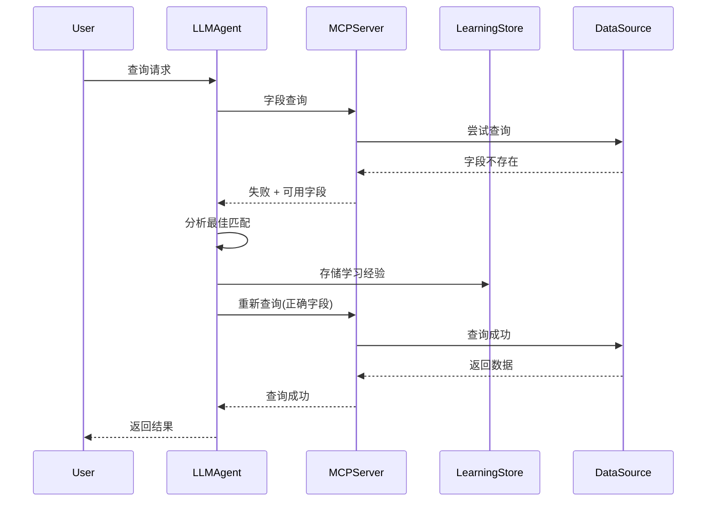

# 交互式学习机制技术设计文档

**设计目标**: 实现LLM Agent的智能字段映射学习系统
**设计原则**: 失败友好、渐进学习、经验复用
**创建日期**: 2025-12-02

---

## 🎯 设计哲学

### 核心理念

传统的字段映射系统采用"配置驱动"模式，需要人工预先定义所有可能的字段映射关系。这种方式的局限性在于：

1. **静态配置**: 无法适应数据源变化
2. **维护成本高**: 新字段需要人工配置
3. **扩展性差**: 新市场接入成本高
4. **用户体验差**: 配置错误导致查询失败

**交互式学习机制**采用"探索驱动"模式，让系统通过实际查询经验自动学习和优化：

```
配置驱动: 预先定义 → 查询 → 成功/失败
探索驱动: 查询 → 失败 → 学习 → 成功 → 经验积累
```

### 设计原则

1. **失败友好**: 查询失败不是错误，而是学习机会
2. **渐进学习**: 每次失败都转化为学习经验
3. **经验复用**: 一次学习，多处受益
4. **透明体验**: 用户无感知的智能优化

---

## 🏗️ 系统架构

### 组件设计

```
┌─────────────────┐    ┌─────────────────┐    ┌─────────────────┐
│   LLM Agent     │    │  MCP Server     │    │  Learning Store │
│                 │    │                 │    │                 │
│ - 智能推断      │◄──►│ - 字段验证      │◄──►│ - 经验存储      │
│ - 学习分析      │    │ - 指导信息      │    │ - 映射关系      │
│ - 重试协调      │    │ - 查询执行      │    │ - 置信度管理    │
└─────────────────┘    └─────────────────┘    └─────────────────┘
```

### 数据流设计



---

## 💡 核心算法设计

### 1. 智能字段匹配算法

#### 基础版本 (当前实现)
```python
def _smart_match(target: str, available_fields: list) -> str:
    """
    基于关键词的简单匹配算法
    """
    # 关键词映射表
    keyword_mappings = {
        "净利润": ["PROFIT", "NET", "收益"],
        "营业收入": ["INCOME", "REVENUE", "收入", "营业"],
        "净资产收益率": ["ROE", "RETURN", "净资产"],
    }

    if target in keyword_mappings:
        keywords = keyword_mappings[target]
        for field in available_fields:
            for keyword in keywords:
                if keyword in field.upper():
                    return field
    return None
```

#### 进阶版本 (语义匹配)
```python
def semantic_match(target: str, available_fields: list) -> str:
    """
    基于语义相似度的匹配算法
    """
    # 使用预训练的词向量模型
    target_vector = get_embedding(target)

    best_match = None
    best_score = 0.0

    for field in available_fields:
        field_vector = get_embedding(field)
        similarity = cosine_similarity(target_vector, field_vector)

        if similarity > best_score and similarity > 0.7:  # 阈值
            best_score = similarity
            best_match = field

    return best_match
```

#### LLM增强版本 (最终目标)
```python
async def llm_enhanced_match(target: str, available_fields: list, context: dict) -> str:
    """
    使用LLM进行智能字段匹配
    """
    prompt = f"""
    根据以下信息，选择最匹配的字段：

    目标字段: {target}
    股票代码: {context['symbol']}
    市场类型: {context['market']}
    可用字段: {available_fields}

    请选择最匹配的字段，并返回JSON格式：
    {{
        "selected_field": "字段名",
        "confidence": 0.95,
        "reasoning": "选择理由"
    }}
    """

    response = await llm_client.generate(prompt)
    return parse_llm_response(response)
```

### 2. 学习经验存储算法

#### 存储结构设计
```python
class LearningStore:
    """
    学习经验存储系统
    """

    def __init__(self):
        # 主存储: 字段映射关系
        self.field_mappings = {}

        # 统计信息: 学习效果追踪
        self.learning_stats = {}

        # 置信度管理: 动态调整机制
        self.confidence_manager = ConfidenceManager()

    def store_mapping(self, symbol: str, target_field: str,
                     actual_field: str, confidence: float):
        """存储字段映射经验"""
        if symbol not in self.field_mappings:
            self.field_mappings[symbol] = {}

        self.field_mappings[symbol][target_field] = {
            'actual_field': actual_field,
            'confidence': confidence,
            'learn_time': datetime.now(),
            'usage_count': 0,
            'success_count': 0
        }
```

#### 置信度动态调整算法
```python
class ConfidenceManager:
    """
    置信度动态管理器
    """

    def update_confidence(self, mapping_record: dict, success: bool):
        """基于使用结果动态调整置信度"""
        current_confidence = mapping_record['confidence']
        usage_count = mapping_record['usage_count']
        success_count = mapping_record['success_count']

        # 更新统计
        mapping_record['usage_count'] += 1
        if success:
            mapping_record['success_count'] += 1

        # 计算成功率
        success_rate = success_count / usage_count

        # 动态调整置信度
        if success_rate > 0.9:  # 成功率很高
            new_confidence = min(current_confidence + 0.01, 0.99)
        elif success_rate < 0.7:  # 成功率较低
            new_confidence = max(current_confidence - 0.02, 0.1)
        else:
            new_confidence = current_confidence

        mapping_record['confidence'] = new_confidence
        return new_confidence
```

### 3. 经验泛化算法

#### 市场级别泛化
```python
def generalize_to_market(self, symbol: str, target_field: str):
    """
    将单个股票的学习经验泛化到整个市场
    """
    market = infer_market_from_symbol(symbol)
    mapping = self.field_mappings[symbol][target_field]

    # 创建市场级别的映射
    if market not in self.market_mappings:
        self.market_mappings[market] = {}

    self.market_mappings[market][target_field] = {
        'actual_field': mapping['actual_field'],
        'confidence': mapping['confidence'] * 0.9,  # 泛化时降低置信度
        'source': 'generalized',
        'source_symbol': symbol
    }
```

#### 语义级别泛化
```python
def semantic_generalization(self, target_field: str, actual_field: str):
    """
    基于语义相似性的字段泛化
    """
    # 识别相似的目标字段
    similar_targets = find_semantically_similar_fields(target_field)

    for similar_target in similar_targets:
        if similarity_score > 0.8:  # 高相似度
            self.store_inferred_mapping(
                similar_target, actual_field,
                confidence=0.7,  # 推断映射置信度较低
                source='semantic_inference'
            )
```

---

## 🔄 学习流程设计

### 标准学习流程

```python
class InteractiveLearningFlow:
    """
    交互式学习流程控制器
    """

    async def execute_query(self, symbol: str, target_fields: list) -> dict:
        """执行带学习能力的查询"""

        # 步骤1: 检查是否有现有学习经验
        learned_mappings = self.get_learned_mappings(symbol, target_fields)

        if learned_mappings:
            # 使用学习经验直接查询
            return await self.direct_query(symbol, learned_mappings)

        # 步骤2: 首次尝试查询
        result = await self.try_direct_query(symbol, target_fields)

        if result['success']:
            return result

        # 步骤3: 学习阶段
        learned_mappings = await self.learn_from_failure(
            symbol, target_fields, result['available_fields']
        )

        # 步骤4: 使用学习结果重新查询
        return await self.direct_query(symbol, learned_mappings)

    async def learn_from_failure(self, symbol: str, target_fields: list,
                               available_fields: list) -> dict:
        """从查询失败中学习"""

        learned_mappings = {}

        for target_field in target_fields:
            # 智能匹配最佳字段
            best_match = await self.smart_match(target_field, available_fields)

            if best_match:
                # 存储学习经验
                confidence = self.calculate_confidence(target_field, best_match)
                self.learning_store.store_mapping(
                    symbol, target_field, best_match, confidence
                )

                learned_mappings[target_field] = best_match

                # 记录学习日志
                self.log_learning_event(symbol, target_field, best_match)

        return learned_mappings
```

### 批量学习优化

```python
class BatchLearningOptimizer:
    """
    批量学习优化器
    """

    async def batch_learn(self, query_batch: list) -> dict:
        """
        批量处理查询，优化学习效率
        """
        # 分组: 按市场分组查询
        market_groups = self.group_by_market(query_batch)

        # 并行学习
        learning_tasks = []
        for market, queries in market_groups.items():
            task = self.parallel_market_learning(market, queries)
            learning_tasks.append(task)

        # 等待所有学习完成
        learning_results = await asyncio.gather(*learning_tasks)

        return self.merge_learning_results(learning_results)

    async def parallel_market_learning(self, market: str, queries: list) -> dict:
        """
        单个市场的并行学习
        """
        # 提取所有目标字段
        all_target_fields = set()
        for query in queries:
            all_target_fields.update(query['target_fields'])

        # 批量字段匹配
        field_mappings = await self.batch_field_matching(
            market, list(all_target_fields)
        )

        # 应用到具体查询
        results = {}
        for query in queries:
            query_mappings = {}
            for target_field in query['target_fields']:
                if target_field in field_mappings:
                    query_mappings[target_field] = field_mappings[target_field]

            results[query['symbol']] = query_mappings

        return results
```

---

## 📊 性能优化策略

### 1. 缓存策略

#### 多层缓存架构
```python
class MultiLevelCache:
    """
    多级缓存系统
    """

    def __init__(self):
        # L1缓存: 内存缓存 (最近查询)
        self.l1_cache = LRUCache(maxsize=1000)

        # L2缓存: SQLite缓存 (持久化学习经验)
        self.l2_cache = SQLiteCache()

        # L3缓存: Redis缓存 (分布式共享)
        self.l3_cache = RedisCache()

    async def get_cached_mapping(self, symbol: str, target_field: str) -> Optional[str]:
        """获取缓存的字段映射"""
        cache_key = f"{symbol}:{target_field}"

        # L1缓存查询
        if cache_key in self.l1_cache:
            return self.l1_cache[cache_key]

        # L2缓存查询
        l2_result = await self.l2_cache.get(cache_key)
        if l2_result:
            self.l1_cache[cache_key] = l2_result
            return l2_result

        # L3缓存查询
        l3_result = await self.l3_cache.get(cache_key)
        if l3_result:
            await self.l2_cache.set(cache_key, l3_result)
            self.l1_cache[cache_key] = l3_result
            return l3_result

        return None
```

### 2. 预学习策略

#### 离线字段分析
```python
class OfflineFieldAnalyzer:
    """
    离线字段分析器
    """

    async def analyze_all_fields(self) -> dict:
        """
        分析所有市场的字段，建立预学习知识库
        """
        field_knowledge = {}

        for market in ['A_STOCK', 'HK_STOCK', 'US_STOCK']:
            # 获取所有可用字段
            available_fields = await self.get_all_fields(market)

            # 字段语义分析
            field_semantics = {}
            for field in available_fields:
                semantics = await self.analyze_field_semantics(field)
                field_semantics[field] = semantics

            field_knowledge[market] = field_semantics

        return field_knowledge

    async def analyze_field_semantics(self, field_name: str) -> dict:
        """
        分析单个字段的语义信息
        """
        prompt = f"""
        分析财务字段的语义信息：
        字段名: {field_name}

        请返回JSON格式的分析结果：
        {{
            "category": "字段类别",
            "synonyms": ["同义词列表"],
            "description": "字段描述",
            "common_queries": ["常见查询表达"]
        }}
        """

        analysis = await self.llm_client.generate(prompt)
        return parse_json_response(analysis)
```

### 3. 增量学习优化

#### 智能更新机制
```python
class IncrementalLearning:
    """
    增量学习管理器
    """

    async def smart_update(self, new_mappings: dict):
        """
        智能更新学习经验
        """
        for symbol, mappings in new_mappings.items():
            for target_field, actual_field in mappings.items():
                # 检查是否已存在映射
                existing = self.get_existing_mapping(symbol, target_field)

                if existing:
                    # 比较并更新
                    if self.is_better_mapping(existing, actual_field):
                        await self.update_mapping(symbol, target_field, actual_field)
                        await self.propagate_update(symbol, target_field, actual_field)
                else:
                    # 新增映射
                    await self.add_new_mapping(symbol, target_field, actual_field)

    def is_better_mapping(self, existing: dict, new_field: str) -> bool:
        """
        判断新映射是否更优
        """
        # 基于多种因素判断
        factors = {
            'semantic_similarity': self.calculate_similarity(existing['field'], new_field),
            'usage_frequency': self.get_usage_frequency(new_field),
            'data_completeness': self.check_data_completeness(new_field)
        }

        # 加权评分
        score = self.calculate_weighted_score(factors)
        return score > 0.7  # 阈值
```

---

## 🔧 实现细节

### 错误处理策略

```python
class LearningErrorHandler:
    """
    学习过程错误处理器
    """

    async def handle_learning_failure(self, error: Exception, context: dict) -> dict:
        """
        处理学习过程中的各种错误
        """
        if isinstance(error, FieldNotAvailableError):
            return await self.handle_field_not_available(error, context)
        elif isinstance(error, LLMTimeoutError):
            return await self.handle_llm_timeout(error, context)
        elif isinstance(error, StorageError):
            return await self.handle_storage_error(error, context)
        else:
            return await self.handle_unknown_error(error, context)

    async def handle_field_not_available(self, error: FieldNotAvailableError, context: dict) -> dict:
        """
        处理字段不可用错误
        """
        # 记录错误日志
        self.logger.warning(f"字段不可用: {error.field} in {context['symbol']}")

        # 尝试寻找替代字段
        alternatives = await self.find_alternative_fields(error.field, context['market'])

        if alternatives:
            return {
                'success': False,
                'alternatives': alternatives,
                'action': 'try_alternatives'
            }
        else:
            return {
                'success': False,
                'message': f"无法找到 {error.field} 的替代字段",
                'action': 'skip_field'
            }
```

### 监控和度量

```python
class LearningMetrics:
    """
    学习效果度量系统
    """

    def track_learning_performance(self, learning_event: dict):
        """
        追踪学习性能指标
        """
        metrics = {
            'timestamp': datetime.now(),
            'symbol': learning_event['symbol'],
            'target_field': learning_event['target_field'],
            'actual_field': learning_event['actual_field'],
            'confidence': learning_event['confidence'],
            'learning_time': learning_event['learning_time'],
            'success': learning_event['success']
        }

        # 存储到时序数据库
        self.metrics_store.store(metrics)

        # 实时分析
        self.real_time_analysis(metrics)

    def generate_performance_report(self, time_range: str) -> dict:
        """
        生成性能报告
        """
        return {
            'learning_success_rate': self.calculate_learning_success_rate(time_range),
            'confidence_trend': self.calculate_confidence_trend(time_range),
            'field_coverage': self.calculate_field_coverage(time_range),
            'user_satisfaction': self.calculate_user_satisfaction(time_range)
        }
```

---

## 🚀 扩展性设计

### 插件化架构

```python
class LearningPlugin:
    """
    学习插件接口
    """

    def can_handle(self, context: dict) -> bool:
        """判断插件是否可以处理该上下文"""
        raise NotImplementedError

    async def learn(self, context: dict) -> dict:
        """执行学习逻辑"""
        raise NotImplementedError

    def get_confidence(self, result: dict) -> float:
        """返回学习结果的置信度"""
        raise NotImplementedError

class SemanticLearningPlugin(LearningPlugin):
    """
    语义学习插件
    """

    def can_handle(self, context: dict) -> bool:
        return context.get('learning_type') == 'semantic'

    async def learn(self, context: dict) -> dict:
        # 实现语义学习逻辑
        pass

class PatternLearningPlugin(LearningPlugin):
    """
    模式学习插件
    """

    def can_handle(self, context: dict) -> bool:
        return context.get('learning_type') == 'pattern'

    async def learn(self, context: dict) -> dict:
        # 实现模式学习逻辑
        pass
```

### 多市场扩展

```python
class MarketAdapter:
    """
    市场适配器接口
    """

    def get_market_specific_rules(self) -> dict:
        """获取市场特定的字段映射规则"""
        raise NotImplementedError

    def normalize_field_name(self, field_name: str) -> str:
        """标准化字段名称"""
        raise NotImplementedError

class HKStockAdapter(MarketAdapter):
    """
    港股市场适配器
    """

    def get_market_specific_rules(self) -> dict:
        return {
            'naming_convention': 'english_uppercase',
            'common_prefixes': ['HOLDER_', 'OPERATE_', 'NET_'],
            'field_categories': {
                'profit': ['PROFIT', 'INCOME'],
                'ratio': ['RATIO', 'RATE', 'PERCENT']
            }
        }
```

---

## 📝 总结

### 核心创新点

1. **失败友好设计**: 将查询失败转化为学习机会，提升用户体验
2. **渐进式学习**: 通过实际使用经验不断优化映射质量
3. **经验泛化**: 单次学习可以在多个场景中复用
4. **智能推断**: 结合规则、语义和LLM的多层次匹配策略

### 技术优势

1. **自适应能力**: 无需人工配置，系统自动学习和适应
2. **高可扩展性**: 插件化架构支持新市场和新字段类型
3. **性能优化**: 多层缓存和批量处理提升响应速度
4. **可观测性**: 完整的监控和度量体系

### 应用前景

这种交互式学习机制不仅适用于财务数据查询，还可以扩展到：

- **API字段映射**: 不同API接口的字段自动适配
- **数据转换系统**: 异构数据源的自动字段对齐
- **配置管理系统**: 动态配置的自动学习和优化
- **智能路由系统**: 基于学习经验的请求路由优化

通过这种设计，系统从"被动配置"转向"主动学习"，大大提升了智能化程度和用户体验。

---

**文档版本**: v1.0
**最后更新**: 2025-12-02
**设计团队**: akshare-value-investment项目组